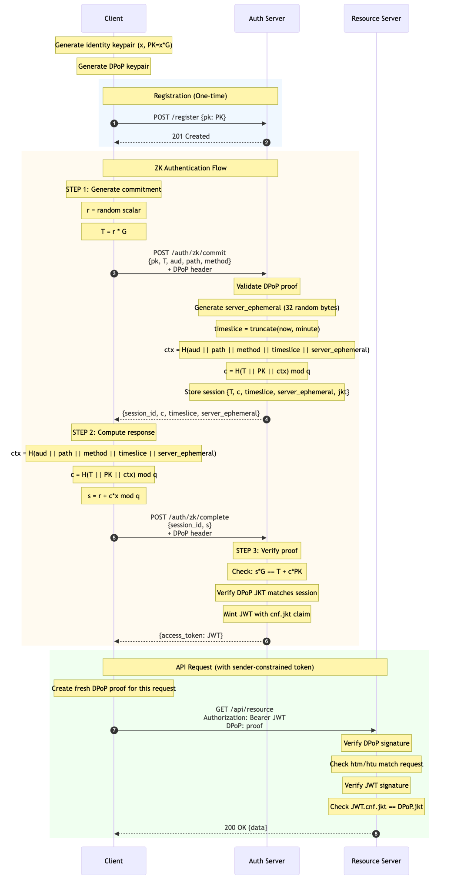

# zkDPoP-Go

A Golang framework for zero-knowledge Demonstration of Proof-of-Possession (zkDPoP) authentication using interactive Schnorr signatures with sender-constrained JWTs.

## Features

- Interactive Schnorr ZK login over secp256k1 or ristretto255
- Issues short-lived, DPoP-bound JWTs (5-15 minutes)
- Sender-constrained tokens via `cnf.jkt` binding to DPoP keys
- Per-request DPoP verification middleware
- Stateless resource servers (validate JWT + DPoP without ZK knowledge)
- Clean extension points for broader ZK authorization
- Comprehensive security hardening (replay protection, tight windows, configurable rate limits)

## Protocol Flow



## How It Works

### The Schnorr Identification Protocol

zkDPoP uses the **Schnorr identification protocol** to prove you know a private key without revealing it. This is a zero-knowledge proof - the server learns nothing about your private key except that you possess it.

#### The Math Behind It

Given:
- **Private key**: `x` (a secret number)
- **Public key**: `PK = x * G` (where G is the curve's generator point)

The protocol works in three steps:

```
┌─────────────────────────────────────────────────────────────────────────┐
│  PROVER (Client)                        VERIFIER (Server)               │
├─────────────────────────────────────────────────────────────────────────┤
│                                                                         │
│  1. COMMITMENT                                                          │
│     Generate random nonce: r                                            │
│     Compute: T = r * G                                                  │
│                               ─────── T ──────────>                     │
│                                                                         │
│  2. CHALLENGE                                                           │
│                               <────── c ───────────                     │
│                                        (random or derived from hash)    │
│                                                                         │
│  3. RESPONSE                                                            │
│     Compute: s = r + c*x (mod q)                                        │
│                               ─────── s ──────────>                     │
│                                                                         │
│  4. VERIFICATION                                                        │
│                                        Check: s*G == T + c*PK           │
│                                        If equal → Proof Valid!          │
│                                                                         │
└─────────────────────────────────────────────────────────────────────────┘
```

#### Why Does This Work?

The verification equation `s*G == T + c*PK` holds because:

```
s*G = (r + c*x)*G           // substituting s = r + c*x
    = r*G + c*x*G           // distributive property of scalar multiplication
    = T + c*PK              // since T = r*G and PK = x*G
```

#### Why Is This Zero-Knowledge?

1. **T is random**: The commitment `T = r*G` is a random point (r is random)
2. **s reveals nothing**: The response `s = r + c*x` looks random because r acts as a one-time pad
3. **No information leaks**: A simulator can produce valid-looking transcripts without knowing x

### DPoP: Sender-Constrained Tokens

Standard bearer tokens can be stolen and reused by anyone. **DPoP (Demonstration of Proof-of-Possession)** fixes this by binding tokens to a specific client keypair.

Each API request includes:
1. **JWT token** with a `cnf.jkt` claim (thumbprint of client's public key)
2. **DPoP proof** - a signed JWT proving possession of the private key

Even if an attacker steals your token, they can't use it without your private key.

### Complete Authentication Flow

1. **Registration**: Client registers their public key with the auth server
2. **ZK Commit**: Client sends commitment T + DPoP proof
3. **Challenge**: Server returns challenge c + server randomness
4. **ZK Complete**: Client sends response s + DPoP proof
5. **Token Issued**: Server verifies proof, issues JWT bound to client's DPoP key
6. **API Calls**: Client includes JWT + fresh DPoP proof with each request

### Security Properties

| Property | How It's Achieved |
|----------|-------------------|
| **Zero-Knowledge** | Schnorr protocol reveals nothing about private key |
| **Replay Protection** | Nonce tracking + tight time windows |
| **Token Binding** | JWT `cnf.jkt` claim + DPoP verification |
| **Request Binding** | DPoP proof includes HTTP method and URL |
| **Freshness** | Server ephemeral + timestamp in challenge |

## Architecture

```
+------------------+          +---------------------+         +-------------------+
|  Client          |          |  Auth Server        |         |  Resource Server  |
|  (DPoP keypair)  |          |  (zkDPoP AuthZ)     |         |  (API + middleware)|
+---------+--------+          +----------+----------+         +---------+---------+
          |                               |                              |
(1) POST /auth/zk/commit  DPoP proof ---> |                              |
          | <--- (2) c, timeslice, server_ephemeral                      |
(3) POST /auth/zk/complete  + s  DPoP --->|  verify schnorr & DPoP       |
          | <--- (4) JWT {cnf.jkt=thumb(DPoP JWK)}                       |
          |                               |                              |
          | --- API call --- DPoP + JWT -------------------------------> | verify DPoP + JWT
          |                               |                              |
```

## Quick Start

```bash
# Start auth server
go run ./cmd/zkdpop-authd

# Start demo API server  
go run ./cmd/zkdpop-demo-api

# Run example client
go run ./examples/client-go

# Use the Ristretto255 group instead of secp256k1
go run ./cmd/zkdpop-authd --curve ristretto255
go run ./examples/client-go --curve ristretto255
```

Both servers expose a `--rate-limit` flag (requests per minute per client). The default of `120` for the authd binary and `240` for the demo API keeps login flows responsive while guarding against brute-force attempts.

## Project Structure

- `cmd/zkdpop-authd` - Reference auth server
- `cmd/zkdpop-demo-api` - Example resource server
- `pkg/crypto/` - Curve interfaces and Schnorr verification
- `pkg/dpop/` - DPoP proof verification and JWK thumbprints
- `pkg/jwt/` - JWT minting/verification with cnf.jkt binding
- `pkg/auth/` - Auth handlers for ZK login endpoints
- `pkg/storage/` - Storage interfaces and implementations
- `pkg/middleware/` - HTTP middleware for DPoP and JWT verification
- `examples/client-go/` - Sample client implementation

## Standards Compliance

- [RFC 9449 - DPoP](https://datatracker.ietf.org/doc/html/rfc9449) - Demonstration of Proof-of-Possession
- [RFC 7800 - JWT Proof-of-Possession](https://datatracker.ietf.org/doc/html/rfc7800) - `cnf.jkt` binding
- [RFC 7638 - JWK Thumbprints](https://datatracker.ietf.org/doc/html/rfc7638) - JWK SHA-256 thumbprints

## License

MIT
